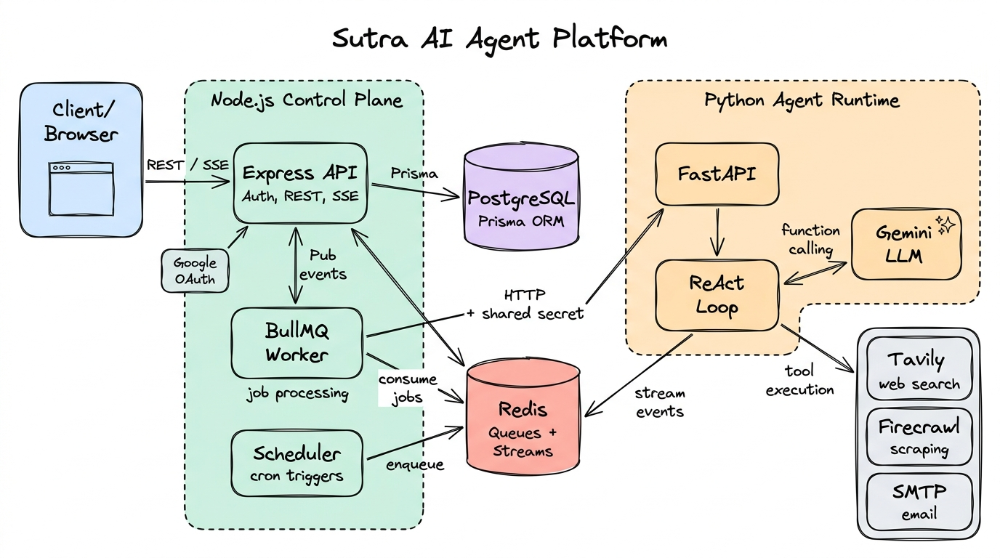

# Sutra — AI Agent Platform

A platform for creating scheduled AI agents that browse the web, research, and deliver results on a cron. Users define an agent once ("send me a morning briefing from these 5 sites every day at 8am"), and Sutra runs it on schedule, streams every reasoning step live, tracks token cost per run, and bills it against a credit balance.

This repository contains the control plane (Node.js) and the agent runtime (Python).

---

## Why Sutra?

Most "AI agent" projects are a single script wrapped around a framework like LangChain. Sutra is built to show what an agent product looks like as a system: a hand-written ReAct loop with no agent framework, a separate control plane that owns auth, billing, and scheduling, and a durable event pipeline that makes every step of a run observable, both while it's running and after it finishes.

---

## Architecture & Data Flow



Sutra is split into two services with a hard boundary. The Node.js backend is the only public-facing service. The Python runtime is private and only accepts requests from the backend.

**Authentication & API:** Users sign in with Google OAuth. Sessions are cookie-based, and every agent, run, and credit query is scoped to the authenticated user. Agents, runs, and credit balances are stored in PostgreSQL through Prisma.

**Scheduling (BullMQ + Redis):**
- Each active agent with a cron pattern is registered as a BullMQ repeatable job.
- Manual triggers and scheduled triggers go through the same queue, so both paths run identical logic.
- On boot, schedules are rebuilt from PostgreSQL. BullMQ stores repeatable jobs only in Redis, so without this step a Redis flush would silently stop every cron.

**Run Execution:**
- A background worker takes the job, checks the user's credit balance, and marks the run `RUNNING`.
- The worker calls the Python runtime over the internal network, authenticated with a shared secret, and passes the database run ID so both services refer to the same run.
- The runtime starts the agent loop as a background task and returns right away.

**The Agent Loop (Python + Gemini):**
- A custom ReAct loop: the model decides on an action, a tool runs, the result goes back into the conversation, and the loop repeats until the model answers or hits an iteration cap.
- Tools: web search (Tavily), page scraping (Firecrawl), email delivery (SMTP).
- Uses Gemini's native function calling. Tool schemas are generated from Pydantic models.
- Rate-limit and service-unavailable errors are retried with exponential backoff. Auth and bad-request errors fail immediately.
- Input and output tokens are counted on every model call and converted to a running USD cost.

**Live Trace Streaming (Redis Streams + SSE):**
- Every step the agent takes (tool called, tool finished, final answer, error) is written as a validated event to a per-run Redis Stream.
- The backend consumes that stream and relays it to the client as Server-Sent Events.
- When the run finishes, the full trace, token count, and cost are saved to the run record, and credits are deducted based on actual cost.
- Clients viewing a finished run get the saved trace replayed from PostgreSQL, so history keeps working after the Redis stream expires.

---

## Technical Decisions & Tradeoffs

**Redis Streams over Redis Pub/Sub for the trace pipeline:**
- **Decision:** Write agent events to a Redis Stream per run instead of publishing them over Pub/Sub.
- **Tradeoff:** Uses more memory than fire-and-forget Pub/Sub and needs TTLs to stay bounded. The benefit is durability: the backend starts a run and then subscribes, and with Pub/Sub every event emitted in that gap is lost. A stream replays from the beginning, so late subscribers still see the whole run.

**Separate Python runtime instead of a single Node.js service:**
- **Decision:** Keep the AI layer in Python (FastAPI) and the control plane in Node.js.
- **Tradeoff:** Two deployables, a network hop, and shared-secret auth between them. In return, each language does what its ecosystem is good at: LLM and scraping SDKs on one side, queues, OAuth, and billing on the other. The runtime is also stateless, so it can be scaled or restarted without touching user-facing state.

**Hand-written ReAct loop instead of LangChain or another agent framework:**
- **Decision:** Implement the think → act → observe loop directly against the Gemini SDK.
- **Tradeoff:** More code to maintain and none of a framework's built-in integrations. In exchange, the loop is fully transparent: every step is visible for tracing, every token is accounted for in billing, and retry and iteration limits are explicit.

**Cost-based credit deduction, charged on completion:**
- **Decision:** Charge credits from the real USD cost of each run, not a flat per-run fee.
- **Tradeoff:** The final charge is only known after the run, so there's a pre-run balance check and a post-run deduction. The deduction is a single atomic conditional update, so concurrent runs can't push a balance negative.

**Separate lifecycle states for agents and runs:**
- **Decision:** Agents use `ACTIVE / PAUSED / INACTIVE` (set by the user). Runs use `QUEUED / RUNNING / SUCCEEDED / FAILED / INSUFFICIENT_CREDITS` (set by the system, with terminal states).
- **Tradeoff:** Two enums instead of one, but "should this agent run?" and "how did this run go?" stay separate. A run rejected for insufficient credits is recorded apart from a real failure.

**Security by default for infrastructure:**
- **Decision:** All published ports are bound to loopback. Redis requires a password and has `CONFIG`, `MODULE`, `REPLICAOF`, and `DEBUG` disabled. The runtime refuses to boot without a strong shared secret. Docker Compose refuses to start if any required secret is missing.
- **Tradeoff:** Local setup takes a few more minutes. In return, a misconfiguration fails loudly at startup instead of leaving an open Redis or an unauthenticated agent endpoint that anyone could use to burn API quota.

---

## Tech Stack

**Control Plane (`apps/backend`)**
- Runtime: Bun / Node.js
- Language: TypeScript
- Framework: Express.js
- Database: PostgreSQL (Prisma ORM)
- Queue & Scheduling: BullMQ, Redis
- Auth: Google OAuth, cookie sessions

**Agent Runtime (`apps/agent-runtime`)**
- Language: Python 3
- Framework: FastAPI
- LLM: Google Gemini (native function calling)
- Tools: Tavily (search), Firecrawl (scraping), SMTP (email)
- Validation: Pydantic
- Event Transport: Redis Streams, Server-Sent Events

**Infrastructure**
- Docker, Docker Compose

---

## API Overview

All routes are under `/api/v1` and require an authenticated session.

| Method | Route | Description |
|--------|-------|-------------|
| `POST` | `/agents` | Create an agent |
| `GET` | `/agents` | List agents (paginated) |
| `GET` | `/agents/:agentId` | Get an agent |
| `PATCH` | `/agents/:agentId` | Update an agent and re-sync its schedule |
| `DELETE` | `/agents/:agentId` | Soft-delete an agent and remove its schedule |
| `POST` | `/agents/:agentId/run` | Trigger a run |
| `GET` | `/runs` | List runs (filter by agent or status) |
| `GET` | `/runs/:runId` | Get a run with its full trace |
| `GET` | `/runs/:runId/stream` | Live SSE trace, or replay if the run has finished |
| `GET` | `/credits` | Current credit balance |
| `GET` | `/dashboard` | Aggregated agent, run, usage, and credit stats |

---

## Run with Docker

### Prerequisites
- Docker & Docker Compose
- Bun
- API keys for Google Gemini, Tavily, and Firecrawl
- A Google OAuth client

### Installation & Execution

1. **Clone the repository**
   ```sh
   git clone https://github.com/iCoderabhishek/sutra-ai-agent.git
   cd sutra-ai-agent
   ```

2. **Environment configuration**

   Copy `.env.example` to `.env` in both `apps/backend` and `apps/agent-runtime`, then fill them in. Required secrets:
   - `AGENT_SHARED_SECRET`: the same value in both files, at least 32 characters
   - `REDIS_PASSWORD`, `POSTGRES_PASSWORD`, `SESSION_SECRET`

   To generate a secret:
   ```sh
   python -c "import secrets; print(secrets.token_urlsafe(32))"
   ```

3. **Start the datastores and control plane**
   ```sh
   cd apps/backend
   docker compose up --build -d
   ```

4. **Apply database migrations**
   ```sh
   bunx prisma migrate dev --schema ../../packages/db/prisma/schema.prisma
   ```

5. **Start the agent runtime** (joins the backend's Docker network)
   ```sh
   cd ../agent-runtime
   docker compose up --build -d
   ```

---

## Status

The control plane and agent runtime are complete. A web frontend (agent creation, configuration, and a live trace viewer) was designed but not built. The backend already provides everything it would need, including the SSE trace stream.
